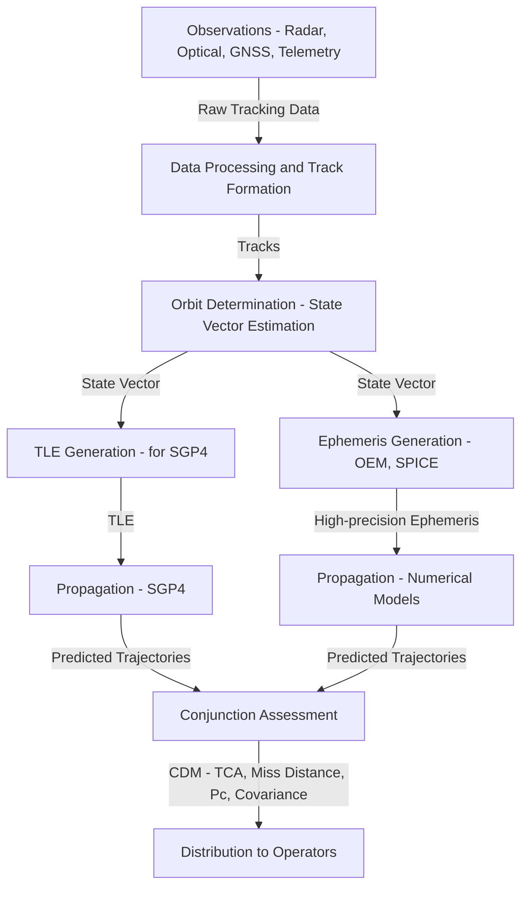

# Where and How do CDMs are from and made of?

```mermaid

flowchart TB
  A[Observations - Radar, Optical, GNSS, Telemetry] -->|Raw Tracking Data| B[Data Processing and Track Formation]
  B -->|Tracks| C[Orbit Determination - State Vector Estimation]

  %% TLE branch
  C -->|State Vector| D1[TLE Generation - for SGP4]
  D1 -->|TLE| E1[Propagation - SGP4]

  %% Ephemeris branch
  C -->|State Vector| D2[Ephemeris Generation - OEM, SPICE]
  D2 -->|High-precision Ephemeris| E2[Propagation - Numerical Models]

  %% Merge
  E1 -->|Predicted Trajectories| F[Conjunction Assessment]
  E2 -->|Predicted Trajectories| F
  F -->|CDM - TCA, Miss Distance, Pc, Covariance| G[Distribution to Operators]


```
