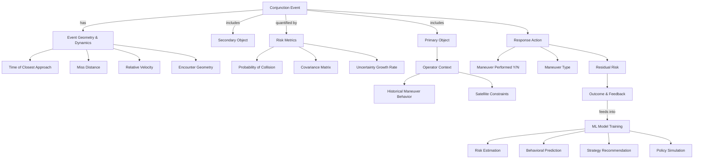

# Ontology for CDM Use in ML Conjunction Risk Response

### 1. CDM Core Entities
- **Conjunction Event**
  - ID, creation time, issuing agency  
- **Primary Object**
  - Satellite ID, type (LEO/GEO, mission class), operator  
- **Secondary Object**
  - Satellite/debris ID, type, operator  

### 2. Event Geometry & Dynamics
- **Time of Closest Approach (TCA)**
- **Miss Distance (3D vector + magnitude)**
- **Relative Velocity**
- **Encounter Geometry**
  - In-track, cross-track, radial separation  

### 3. Uncertainty & Risk Metrics
- **Covariance Matrix (6x6, position & velocity)**
- **Probability of Collision (Pc)**
- **Screening Volume Definition**
- **Uncertainty Growth Rate**  

### 4. Operator Context
- **Historical Maneuver Behavior**
  - Past maneuver thresholds (e.g., Pc > 1e-4)  
  - Responsiveness (time between CDM issuance and action)  
- **Satellite Constraints**
  - Fuel availability, mission criticality, maneuverability class  

### 5. Outcome & Feedback
- **Response Action**
  - Maneuver performed (Y/N)  
  - Maneuver type (avoidance, station-keeping, hybrid)  
- **Residual Risk**
  - Post-maneuver miss distance, Pc  
- **CDM Follow-ups**
  - Event resolution messages  

---

## 🧠 How ML Can Use This Ontology

- **Input Features (X):**
  - Event Geometry & Dynamics  
  - Uncertainty & Risk Metrics  
  - Operator Context (if available)  

- **Labels / Outcomes (Y):**
  - Response Action (maneuver vs. no maneuver)  
  - Residual Risk (improvement vs. degradation)  

- **Learning Tasks:**
  1. **Risk Estimation:** Predict Pc and miss distance distributions given raw tracking data.  
  2. **Behavioral Prediction:** Estimate likelihood of maneuver by a given operator or satellite class.  
  3. **Strategy Recommendation:** Suggest optimal strategy (prevent, mitigate, accept, share/transfer).  
  4. **Policy Simulation:** Train reinforcement learning agents on historical CDM outcomes.  

---

## 🔗 Relationships in the Ontology

- **Conjunction Event → has → Event Geometry & Dynamics**  
- **Conjunction Event → includes → Primary Object & Secondary Object**  
- **Event Geometry → quantified by → Risk Metrics**  
- **Operator Context → influences → Response Action**  
- **Response Action → updates → Outcome & Feedback**  
- **Outcome & Feedback → feeds back into → ML model training**  

---

## 🌟 Insights

- This ontology lets us treat CDMs as **structured learning examples**, not just warnings.  
- By linking **event parameters** (geometry, risk, covariance) with **outcomes** (maneuver/no maneuver, post-event risk), we can build **supervised ML datasets**.  
- Over time, the ontology supports **behavioral modeling of operators** and **game-theoretic simulation** of multi-actor space traffic management.  

---

