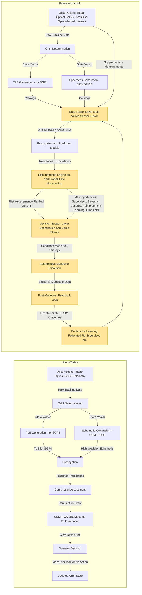

# crr_workflow

```mermaid
flowchart LR
  %% === TODAY PIPELINE ===
  subgraph TODAY["As-of-Today"]
    direction TB
    A1[Observations: Radar Optical GNSS Telemetry] -->|Raw Tracking Data| B1[Orbit Determination]
    B1 -->|State Vector| C1[TLE Generation - for SGP4]
    B1 -->|State Vector| D1[Ephemeris Generation - OEM SPICE]

    C1 -->|TLE for SGP4| E1[Propagation]
    D1 -->|High-precision Ephemeris| E1

    E1 -->|Predicted Trajectories| F1[Conjunction Assessment]
    F1 -->|Conjunction Event| G1[CDM: TCA MissDistance Pc Covariance]
    G1 -->|CDM Distributed| H1[Operator Decision]
    H1 -->|Maneuver Plan or No Action| I1[Updated Orbit State]
  end

  %% === FUTURE PIPELINE ===
  subgraph FUTURE["Future with AI/ML"]
    direction TB
    A2[Observations: Radar Optical GNSS Crosslinks Space-based Sensors] -->|Raw Tracking Data| B2[Orbit Determination]
    B2 -->|State Vector| C2[TLE Generation - for SGP4]
    B2 -->|State Vector| D2[Ephemeris Generation - OEM SPICE]

    C2 -->|Catalogs| J2[Data Fusion Layer Multi-source Sensor Fusion]
    D2 -->|Catalogs| J2
    A2 -->|Supplementary Measurements| J2

    J2 -->|Unified State + Covariance| E2[Propagation and Prediction Models]
    E2 -->|Trajectories + Uncertainty| K2[Risk Inference Engine ML and Probabilistic Forecasting]

    K2 -->|Risk Assessment + Ranked Options| L2[Decision Support Layer Optimization and Game Theory]
    L2 -->|Candidate Maneuver Strategy| M2[Autonomous Maneuver Execution]
    M2 -->|Executed Maneuver Data| N2[Post-Maneuver Feedback Loop]

    N2 -->|Updated State + CDM Outcomes| O2[Continuous Learning Federated RL Supervised ML]
    O2 --> J2

    K2 -.->|ML Opportunities: Supervised, Bayesian Updates, Reinforcement Learning, Graph NN| L2
  end

  %% === Styling ===
  class J2,K2,L2,M2,N2,O2 new;
  classDef new fill:#ffe599,stroke:#cc9900;
  style A1 padding-top:50px
  style A2 padding-top:50px


```
