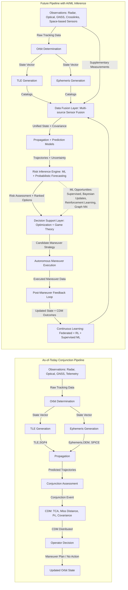

# crr_workflow

```mermaid
flowchart LR
    subgraph TODAY["As-of-Today Conjunction Pipeline"]
        A1[Observations: Radar, Optical, GNSS, Telemetry] -->|Raw Tracking Data| B1[Orbit Determination]
        B1 -->|State Vector| C1[TLE Generation]
        B1 -->|State Vector| D1[Ephemeris Generation]

        C1 -->|TLE,SGP4| E1[Propagation]
        D1 -->|Ephemeris,OEM, SPICE| E1[Propagation]

        E1 -->|Predicted Trajectories| F1[Conjunction Assessment]
        F1 -->|Conjunction Event| G1[CDM: TCA, Miss Distance, Pc, Covariance]
        G1 -->|CDM Distributed| H1[Operator Decision]
        H1 -->|Maneuver Plan / No Action| I1[Updated Orbit State]
    end

    subgraph FUTURE["Future Pipeline with AI/ML Inference"]
        A2[Observations: Radar, Optical, GNSS, Crosslinks, Space-based Sensors] -->|Raw Tracking Data| B2[Orbit Determination]
        B2 -->|State Vector| C2[TLE Generation]
        B2 -->|State Vector| D2[Ephemeris Generation]

        C2 & D2 -->|Catalogs| J2[Data Fusion Layer: Multi-source Sensor Fusion]
        A2 -->|Supplementary Measurements| J2

        J2 -->|Unified State + Covariance| E2[Propagation + Prediction Models]
        E2 -->|Trajectories + Uncertainty| K2[Risk Inference Engine: ML + Probabilistic Forecasting]

        K2 -->|Risk Assessment + Ranked Options| L2[Decision Support Layer: Optimization + Game Theory]
        L2 -->|Candidate Maneuver Strategy| M2[Autonomous Maneuver Execution]
        M2 -->|Executed Maneuver Data| N2[Post-Maneuver Feedback Loop]

        N2 -->|Updated State + CDM Outcomes| O2[Continuous Learning: Federated + RL + Supervised ML]
        O2 --> J2

        %% Highlight opportunities
        K2 -.->|ML Opportunities:\nSupervised, Bayesian Updates,\nReinforcement Learning, Graph NN| L2
    end

```

    TODAY --> FUTURE
