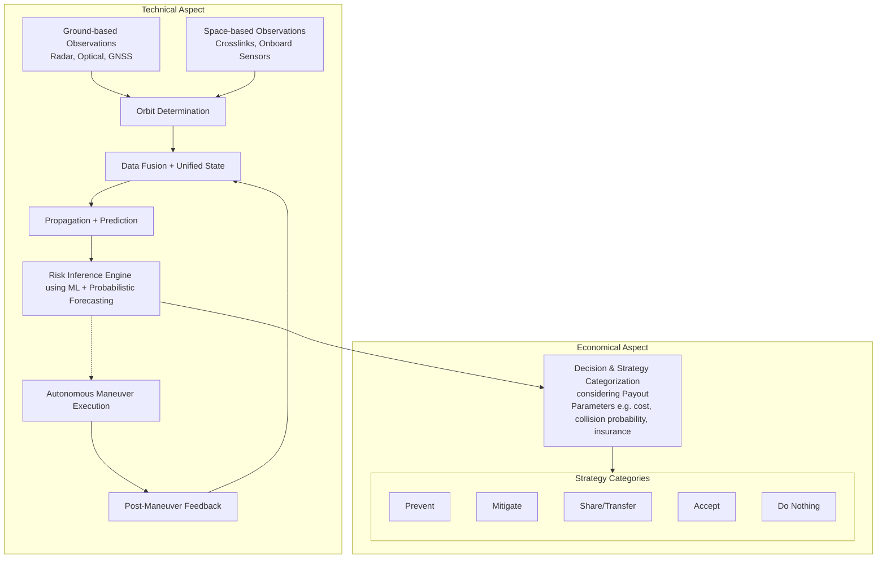
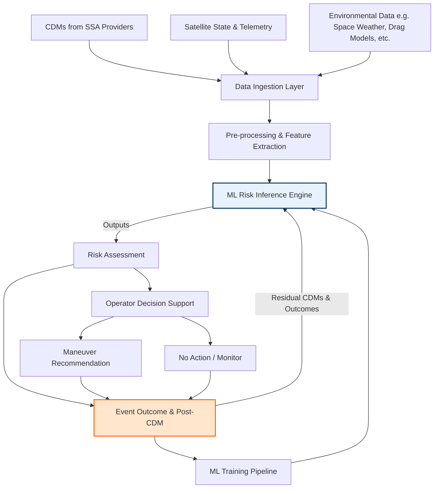
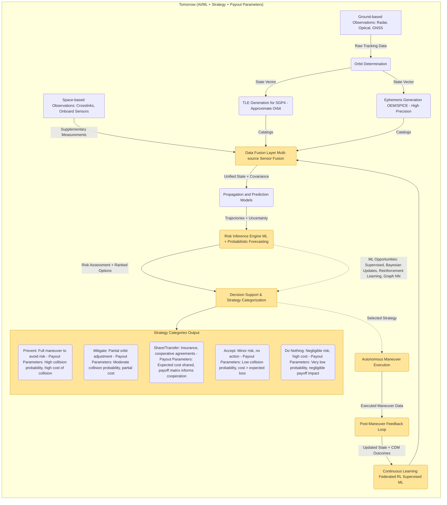

# Space Object Tracking and Conjunction Risk Response Pipeline

## Abstract: Tomorrow Collision Avoidance Pipeline

The future collision avoidance pipeline integrates both human-in-the-loop ground-based observations and autonomous space-based measurements to feed a unified data fusion and orbit determination system. Technical operations include orbit propagation, risk inference using AI/ML models, and autonomous maneuver execution with post-maneuver feedback. 

Economical considerations are captured through a decision and strategy categorization layer, where actionable strategies—Prevent, Mitigate, Share/Transfer, Accept, or Do Nothing—are selected based on payout parameters such as collision probability, maneuver cost, and potential insurance or cooperative arrangements. 

The pipeline forms a closed-loop system: technical measurements drive ML-based risk assessment, which informs strategic decisions, while outcomes and feedback further train the AI models for increasingly autonomous operations. This design balances **technical accuracy** with **cost-effective and risk-aware decision-making** in orbital collision management.

## Focus on this study (Machine Learning Model including CDM)

## Technical Aspect of Workflow Pipelines

### As-of Today Workflow

Currently, satellites and debris are tracked using **ground-based observations** such as radars, optical telescopes, GNSS signals, and telemetry from spacecraft. This raw tracking data is processed through **orbit determination** to estimate each object’s position and velocity in space. From here, simplified orbit models called **Two-Line Elements (TLEs)** are generated for fast predictions, while **ephemeris files** are created for high-precision trajectory modeling. 

These models are propagated forward in time to predict trajectories and checked for possible close approaches, called **conjunctions**. When a potential risk is identified, a **Conjunction Data Message (CDM)** is issued, containing details like time of closest approach, miss distance, and probability of collision. Operators then decide whether to maneuver or take no action. Once a decision is executed, the new orbit state is updated, and the cycle continues with fresh observations.  

---

### AI/ML Future Workflow

In the future, tracking expands to include both **ground-based sensors** (radar, optical, GNSS) and **space-based sensors** (crosslinks between satellites and onboard measurement systems). Ground data continues to feed **orbit determination**, while space-based inputs not only improve orbit estimation but also act as **supplementary measurements** feeding into a **multi-source data fusion layer**. This fusion provides a more complete and accurate picture of the orbital environment.  

From there, trajectories and uncertainties are processed by a **risk inference engine**, which uses AI and machine learning to forecast collision risks and rank decision options. A **decision support layer** then optimizes strategies using tools like game theory, and candidate maneuvers can be executed autonomously. After execution, a **feedback loop** records the outcome and updates the system, while a **continuous learning framework** (including reinforcement learning and supervised updates) improves the models over time.  

The AI/ML blocks—**data fusion, risk inference, decision support, autonomous execution, and continuous learning**—introduce speed, adaptability, and predictive intelligence that today’s workflow lacks.

## Comparison: Today vs AI/ML Future Pipeline

| Aspect                  | Today (As-of)                                | Tomorrow (AI/ML Future)                          |
|--------------------------|-----------------------------------------------|--------------------------------------------------|
| **Observation Sources** | Ground-based only (radar, optical, GNSS, telemetry) | Ground + space-based (crosslinks, onboard sensors) |
| **Data Processing**     | Orbit determination → TLE / Ephemeris        | Orbit determination + multi-source **data fusion** |
| **Trajectory Prediction** | Propagation with fixed models                | Propagation + AI-enhanced prediction with uncertainties |
| **Risk Assessment**     | Conjunction assessment → CDM alerts           | **Risk inference engine** with ML & probabilistic forecasting |
| **Decision Making**     | Human operators interpret CDMs and decide     | **Decision support layer** with optimization & game theory |
| **Maneuver Execution**  | Manual execution after operator approval      | **Autonomous maneuver execution** with oversight |
| **Learning**            | Static, relies on new observations only       | **Continuous learning** (supervised + RL updates) |
| **Strengths**           | Mature, trusted, human oversight              | Faster, smarter, adaptive, scales with traffic    |
| **Weaknesses**          | Slow, reactive, operator bottleneck           | Needs trust, validation, and robust AI models     |

## Technical + Strategic Layers of Collision Avoidance

### Today
- **Observations** rely on ground-based radar, optical, GNSS, and telemetry.  
- **Orbit determination** produces TLEs and ephemerides.  
- **Conjunction assessment** identifies risks.  
- **Operator decisions** are made manually, often under time pressure.  
- Strategies are limited to **preventing**, **mitigating**, or **accepting** the risk.  

### Tomorrow (AI/ML Future)
- **Observations** expand to include space-based crosslinks and onboard sensors.  
- **Data fusion** creates a unified orbital picture.  
- **AI/ML risk inference** models not only predict risks but quantify uncertainties.  
- A **decision support layer** evaluates **cost–benefit tradeoffs** of maneuvers using optimization and game theory.  
- Operators (or autonomous systems) can categorize actions into:  
  - **Prevention** (active avoidance, design choices),  
  - **Mitigation** (reduce severity),  
  - **Share/Transfer** (insurance, joint operations),  
  - **Accept** (low risk, tolerable), or  
  - **Do Nothing** (rational default).  
- Decisions feed into **autonomous maneuver execution**, with feedback loops driving **continuous learning**.  

# 🛰️ Game Theory in Collision Avoidance

## Why Game Theory Matters  
When two satellite operators face a close approach (conjunction), they both need to decide whether to **maneuver** or **not maneuver**. This decision is not purely technical — it involves **costs, risks, and incentives**.  
- **Maneuvering**: increases safety but consumes fuel, reduces mission lifetime, and may disrupt services.  
- **Not maneuvering**: avoids immediate costs but leaves the collision risk unresolved.  

This creates a **strategic dilemma** because the best outcome for one operator may depend on the choice of the other.

---

## Example: A Prisoner’s Dilemma in Space  
This scenario can be modeled as a **Prisoner’s Dilemma**, where each operator must choose to maneuver or not.  

### Payoff Matrix  

| Operator A \ Operator B | Maneuver                     | Not Maneuver               |
|--------------------------|------------------------------|-----------------------------|
| **Maneuver**            | (-1, -1) Safe, both pay cost | (-1, 0) A pays, B free rides |
| **Not Maneuver**        | (0, -1) A free rides, B pays | (-100, -100) Collision risk |

- **-1** → maneuver cost (fuel, service disruption)  
- **0** → no immediate cost  
- **-100** → catastrophic collision loss  

---

## Insights  

- **Short-term rationality**: Each operator wants the other to maneuver while avoiding costs themselves.  
- **Free riding problem**: If one maneuvers and the other does not, the non-maneuvering operator benefits without cost.  
- **Mutual risk**: If both refuse to maneuver, the worst outcome occurs — possible collision.  
- **Systemic issue**: Without coordination, operators may under-respond, leaving the whole system at higher risk.  

---

## Strategy Categorization & Considerations  

### 1. Prevent  
- **Goal:** Avoid risk entirely.  
- **Considerations:** Probability of collision, fuel availability, mission-critical payloads.  
- **Parameters for payout calculation:** Cost of maneuver, expected loss if collision occurs, likelihood of avoidance success.

### 2. Mitigate  
- **Goal:** Reduce likelihood or severity of impact.  
- **Considerations:** Partial orbital adjustments, shielding, operational flexibility.  
- **Parameters:** Residual risk after mitigation, maneuver cost, operational impact.

### 3. Share / Transfer  
- **Goal:** Spread risk via cooperative mechanisms.  
- **Considerations:** Liability agreements, insurance coverage, joint operations.  
- **Parameters:** Insurance premium, shared risk percentage, expected payout in case of collision.

### 4. Accept  
- **Goal:** Acknowledge risk but take no preventive action.  
- **Considerations:** Low probability, minor potential impact, mission priority.  
- **Parameters:** Expected cost of collision, risk tolerance, cost of maneuvers.

### 5. Do Nothing  
- **Goal:** Default when risk is negligible.  
- **Considerations:** Cost exceeds expected benefit, extremely low probability.  
- **Parameters:** Risk probability, potential loss, operational cost of maneuver.

---

## Moving Toward Smarter Decisions  

To overcome the dilemma and optimize strategies:  
- **Coordination protocols:** Shared decision frameworks or AI arbitration to assign responsibility fairly.  
- **Insurance & contracts:** Risk can be shared or transferred to incentivize safe behavior.  
- **AI-enhanced decision support:** Integrates technical risk, cost models, and game theory payoffs to suggest optimal strategies.  

✅ This layer allows the **Tomorrow pipeline** to not only predict risks but also **quantify costs, incentives, and optimal strategies**, making autonomous or assisted maneuvers rational, fair, and efficient.

# Tomorrow Pipeline: AI/ML + Integrated Strategy + Payout Parameters

This workflow represents the future vision of autonomous collision avoidance for space objects, integrating AI/ML, high-fidelity orbit propagation, and decision-making informed by payout parameters (game theory considerations).

## Observation Layer

- **Ground-based Observations (Left, human-in-the-loop)**  
  Radar, Optical, GNSS measurements feed orbit determination. Represents current human-monitored and operated sensors.

- **Space-based Observations (Right, autonomous / ML-assisted)**  
  Crosslinks between satellites, onboard sensors, and space-based platforms provide supplementary measurements. These feed the data fusion layer for autonomous monitoring.

## Orbit Determination & Propagation

- **TLE Generation for SGP4 (Approximate Orbit)**  
  Provides fast, compact orbital elements for catalog tracking and rapid propagation.

- **Ephemeris Generation OEM/SPICE (High Precision)**  
  Provides high-fidelity orbit data for precise conjunction assessment and maneuver planning.

- Both TLE and Ephemeris feed the **Data Fusion Layer**, which combines multi-source information into unified states and covariances.

- **Propagation and Prediction Models** take unified states to predict trajectories and uncertainties.

## Risk Inference

- **Risk Inference Engine (ML + Probabilistic Forecasting)** evaluates collision probabilities and ranks risk scenarios.  
- Supports multiple ML approaches: supervised learning, Bayesian updates, reinforcement learning, graph neural networks.

## Integrated Decision & Strategy Layer

- Combines **risk assessment** with **payout parameters** (cost-benefit, collision probability, insurance, maneuver cost) to categorize strategies:  
  - **Prevent:** Full maneuver to avoid risk  
  - **Mitigate:** Partial orbit adjustment  
  - **Share/Transfer:** Insurance or cooperative agreements  
  - **Accept:** Minor risk, no action  
  - **Do Nothing:** Negligible risk, high cost  

- The **selected strategy** is indicated via a **dotted line** to autonomous maneuver execution, showing that over time the AI system learns and can execute strategies independently.

## Execution & Feedback

- **Autonomous Maneuver Execution** performs the selected strategy.  
- **Post-Maneuver Feedback Loop** records executed maneuvers and updated CDM outcomes.  
- **Continuous Learning** updates the ML models in a federated or supervised manner, closing the feedback loop.

## Notes

- Left-right split emphasizes **human-in-the-loop (ground-based)** versus **autonomous ML-assisted (space-based)** flow.  
- Strategy categorization integrates **game theory / payout parameters** for informed decision-making.  
- TLE-SGP4 is suitable for fast, approximate propagation; Ephemeris-OEM/SPICE is high-precision for critical maneuvers.
